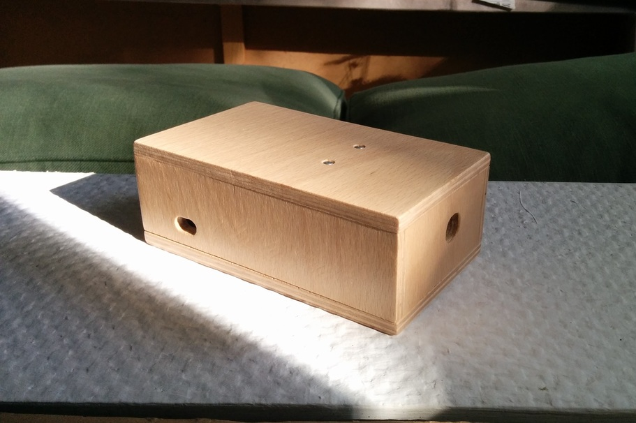

# RFID Jukebox 

The jukebox allows you to use RFID tags to control [Mopidy](https://mopidy.com/) and play songs from Spotify (through the [Mopidy-Spotify plugin](https://github.com/mopidy/mopidy-spotify)). It runs on the Raspberry Pi.

## Features

* RFID based playback
* Playing music from Spotify, internet radio (m3u streams) and local files
* Synchronized, multi-room audio
* Modern, mobile-friendly web UI
* Smartphone based volume control
* Support for [Spotify Connect](https://www.spotify.com/de/connect/)

## Requirements

In case you want to build your own, here are the components that I used. Since I built two different configurations, I am listing both here:
* Living room jukebox (connected with 3,5 mm jack plug):
  * [Raspberry Pi 3 B](https://www.raspberrypi.org/products/raspberry-pi-3-model-b/) or newer + microSD card
  * USB sound card
    ([example](https://www.amazon.de/dp/B00IRVQ0F8))
  * Normal 2.5A power supply ([example](https://www.raspberrypi.org/products/raspberry-pi-universal-power-supply/))
* Kitchen jukebox (connected with speaker cables):
  * Raspberry Pi Zero W
    ([example](https://www.berrybase.de/raspberry-pi-zero-wh)) + microSD card
  * [JustBoom Amp Zero pHAT](https://shop.justboom.co/products/justboom-amp-zero-phat)
  * A stacking header to mount both the amplifier and connect the RFID reader
    ([example](https://www.berrybase.de/raspberry-pi-co/raspberry-pi/bauelemente/stacking-header-f-252-r-raspberry-2x20-61-40-polig-rm-2-54))
  * 9V 24W power supply ([example](https://www.conrad.com/p/voltcraft-sps24-24w-mains-psu-adjustable-voltage-9-v-dc-12-v-dc-135-v-dc-15-v-dc-18-v-dc-20-v-dc-24-v-dc-1000-m-513003))
* An MFRC522 SPI RFID reader
  ([example](https://www.berrybase.de/raspberry-pi-co/sensoren-module/rfid-nfc/rfid-leseger-228-t-mit-spi-schnittstelle-inkl.-karte-dongle))
* Jumper cables to connect the RFID reader to the Pi
  ([example](https://www.berrybase.de/raspberry-pi-co/raspberry-pi/kabel-adapter/gpio-csi-dsi-kabel/40pin-jumper/dupont-kabel-female-150-female-trennbar))
* RFID tags
  ([example](https://www.berrybase.de/raspberry-pi-co/sensoren-module/rfid-nfc/rfid-aufkleber-rund-248-30mm-13-56mhz-1kb))

There are a number of alternative HATs available that provide different types of audio output (analog, digital, amplified, 3,5 mm jack, etc.), and may be suited to your needs:
* [HiFiBerry](https://www.hifiberry.com/)
* [JustBoom](https://www.justboom.co/)
* WM8960 Hi-Fi Stereo Sound HAT ([example](https://www.berrybase.de/raspberry-pi-co/raspberry-pi/gpio-hats-phats/audio/wm8960-hi-fi-stereo-sound-hat-f-252-r-raspberry-pi))
* [IQaudio](https://www.raspberrypi.org/blog/iqaudio-is-now-raspberry-pi/)

Be sure to check if the HAT you choose can provide and handle the power you need for your speakers.

## Software

The jukebox consists of the following software components:
* [Mopidy](https://mopidy.com/) with the following extensions:
  * [Mopidy-Spotify](https://mopidy.com/ext/spotify/)
  * [Mopidy-Scrobbler](https://mopidy.com/ext/scrobbler/), to scrobble to [Last.fm](https://www.last.fm/)
  * [Mopidy-Iris](https://mopidy.com/ext/iris/), mobile-friendly UI
* [RFID Jukebox](https://github.com/scheleaap/rfid-jukebox) (this repository), which reads RFID tags and controls Mopidy
* [Snapcast](https://github.com/badaix/snapcast) for synchronized, multi-room audio
* [Snapcast Android client](https://play.google.com/store/apps/details?id=de.badaix.snapcast&hl=nl&gl=US) to control the volume
* _(Experimental)_ [Raspotify](https://github.com/dtcooper/raspotify) as an alternative to stream music from the Spotify client directly. Currently, I am experiencing issues because the music is played back too fast.

### Installation

I use Ansible to install and configure my Raspberry Pi's.

You can adapt the playbook to your purposes:
you need to change the host names and provide/change the variables.

[Playbook](https://github.com/scheleaap/home-infrastructure)

The playbook uses several roles I wrote:

* [Ansible role for Mopidy](https://github.com/scheleaap/ansible-role-mopidy)
* [Ansible role for Snapcast](https://github.com/scheleaap/ansible-role-snapcast)
* [Ansible role for the RFID Jukebox](https://github.com/scheleaap/ansible-role-rfid-jukebox)
* [Ansible role for Raspotify](https://github.com/scheleaap/ansible-role-raspotify)
* [Ansible role for Raspberry Pi](https://github.com/scheleaap/ansible-role-raspberrypi)
